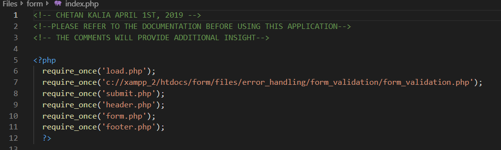
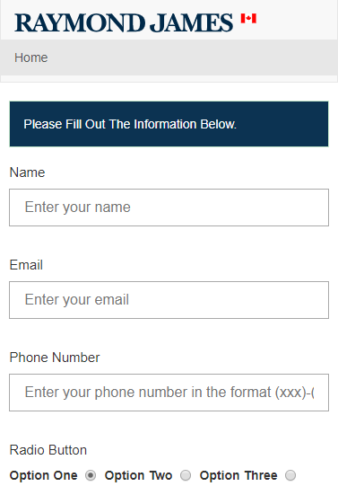
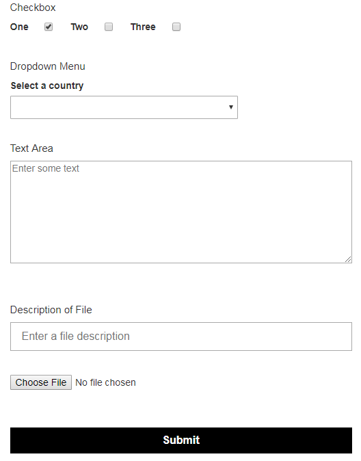
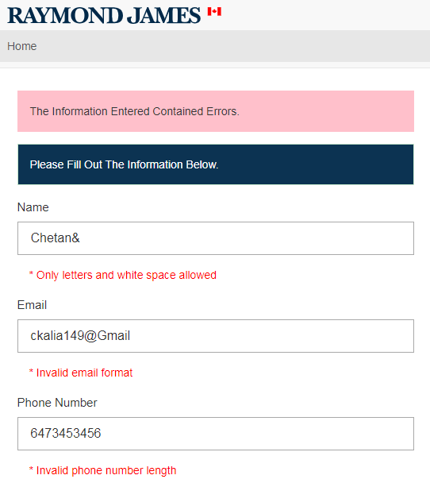
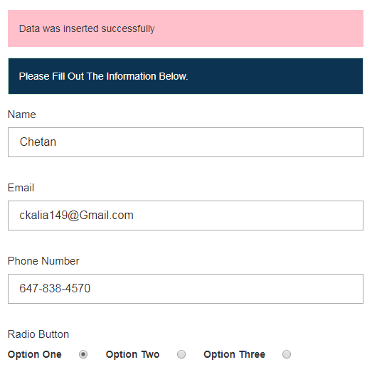
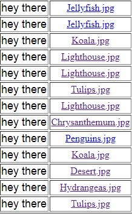
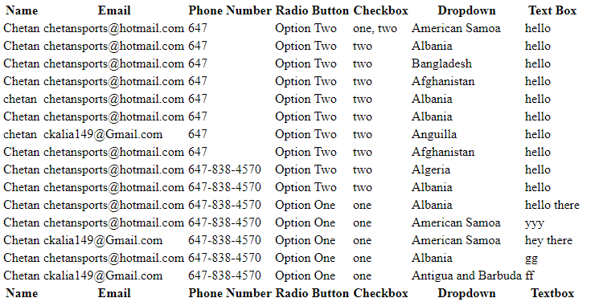

# PHP/MySQL Multipurpose Template_Form
This form is a secure PHP form made for Raymond James Ltd. This form is considered a template form since it contains distinctive features 
that can be used or discarded for any purpose.    
This form undergoes both form validation and input validation protecting against SQL Injection and Cross Site Scripting Attacks using PHP methods.
    The form uses cookies to save user input and stores them in a MySQL database. This data is then displayed in tables for use.
The form is fully responsive and works cross platform to deliver a simple yet elegant user interface on most devices. The front end uses Bootstrap.
   
Each component of the form is stored in a seperate file which is then required in the index.php file. This allows any component of the form to be easily modifiable, which is the purpose for a template form.
  
The form requires you to install a local server to view it.  

This image displays the index.php file where the form can be accessed through. This file avoids using hundreds of lines of code, and instead requires a list of other files that represent the components of the form. This makes using/discarding the features of the form very easy, which is the goal for the template form.    

   

This image displays the first half of the form on a mobile device. The form contains a name/email/phone number input field, a dropdown list, a text box, radio buttons, checkboxes, a file upload/description input, and a submit button.   
   

This image shows the second half of the form on a larger screen size.   
   

This image shows the error handling aspect of the form. The form only allows the user to submit the form if all the conditions are met. An example of this for the first three input fields are shown below.   
   

If all the input fields are filled and the conditions are met then an alert message pops up telling the user their file has been uploaded and that the data was inserted successfully.   
   

The uploaded images/files are then stored on the server while the file description and file name are stored in the MySQL database.   

This image shows one of the two tables that give the full path to the files that were uploaded by the user. These files can be accessed easily by clicking on the file name.   
   

This image shows the second table that displays the user information entered in the form. The arrays are unserialized so they can be understood. The form allows the retrieval of any given row from the database table or it gives the option to display every single row in the table as shown.   
   
